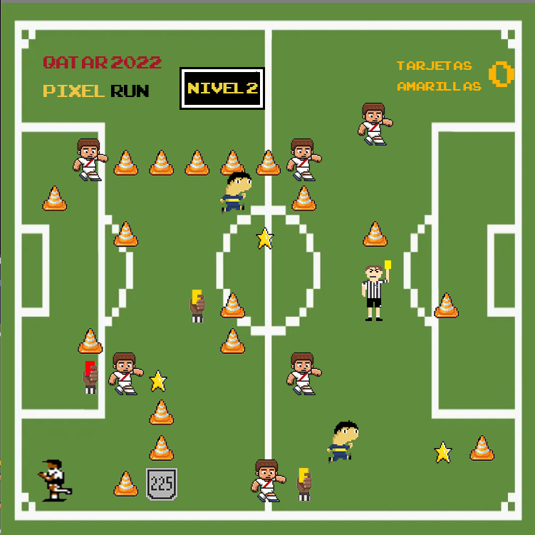

# Qatar 2022 Pixel Run

## Equipo de desarrollo

- Marcos Gurruchaga
- Gregorio Ondjian
- Luca Prestia
- Junior Rodriguez

## Trailer
https://youtu.be/uPzdDQqDV3U

## Capturas

## Reglas de Juego / Instrucciones

Agarrá las estrellitas para que aparezca la copa!
Cuidado con pablo perez, los arbitros y las tarjetas!
No olvide de tocar el articulo 225 para anular sus amarillas!

Controles - WASD

## Descripcion
Juego creado durante la cursada de Paradigmas de programación 2022. Cursos K2004 y K2104

